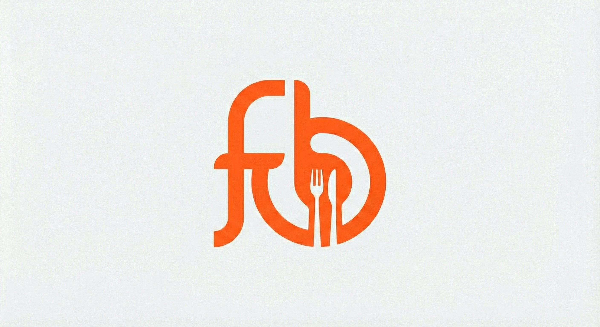

# FreeBarr

### The Lightweight, Real-Time, Open-Source Restaurant & Bar POS System

**FreeBarr** is a completely free, open-source Point of Sale (POS) and management system designed for bars, restaurants, and cafes. Built with **Python (Flask)** and **Socket.IO**, it creates a powerful, synchronized multi-device environment where orders taken on a phone or tablet appear instantly on the cashier and kitchen displays.

FreeBarr utilizes an embedded **SQLite database** and runs locally, making it an excellent, offline-first solution for minimizing operational costs.




## Core Features & Functionality

### Real-Time Order Management
* **Cross-Device Synchronization:** Orders submitted by staff via the local webpage (on any device) are instantly visible across the entire system using **Socket.IO** for real-time data flow.
* **Active Table Tracking:** The "Cashier" view displays all active orders and tables, allowing staff to manage, edit, or close tickets efficiently.
* **Order Modification:** Staff can load a running tab, add or remove items, input specific comments for the kitchen (e.g., "no ice"), and save the changes instantly.

### Windows Thermal Printing
* **Native Printing Support:** The system is designed to use the **Windows API (`pywin32`)** for sending raw ESC/POS commands to standard thermal receipt printers (tested with POS-80C models).
* **Kitchen Tickets:** Automatically prints a dedicated ticket for the kitchen or bar with detailed item lists and comments upon order submission.
* **Customer Receipts:** Consolidates all active orders for a single table into a professional, itemized bill for printing before payment.

### Cashier and Session Control
* **Flexible Payments:** Orders can be marked as paid via **Cash** or **Card**.
* **Daily Sales Summary:** Tracks sales totals in real-time, categorized by payment method (Cash/Card) and product type (Food/Drink).
* **History and Audit:** The History module allows managers to correct mistakes by **Reverting Payment** (re-opening the table) or **Voiding** an order (retaining a record while removing it from sales totals).

### Inventory and Menu Management
* **Centralized Menu:** Menu data is stored securely in the `pos.db` SQLite database.
* **CRUD Operations:** Full control to Add, Edit, and Delete products, prices, and categories directly through the application's "Inventory" management tab without requiring a server restart.

## Technical Specifications

| Component | Technology | Description |
| :--- | :--- | :--- |
| **Backend** | Python 3, Flask | The core application server and API. |
| **Database** | SQLite (`pos.db`) | A lightweight, file-based database requiring zero configuration. |
| **Real-Time** | Flask-SocketIO | Handles WebSocket connections for instantaneous data sync. |
| **Frontend** | HTML5, CSS3, JavaScript | Provides a responsive, locally-served web interface. |
| **Printing** | `pywin32` | Windows-specific module for raw thermal printing integration. |

## 🚀 Getting Started

## Installation & Usage

1.  **Clone, Install and Setup:**
    ```
    git clone [https://github.com/FreeBarr/FreeBarr.git](https://github.com/FreeBarr/FreeBarr.git)
    cd FreeBarr
    pip install -r windows_requirements.txt
    ```
    To run the pip command to install the required modules, you must first install Python from [python.org](https://www.python.org/downloads/) or:
    ```
    curl -o python_installer.exe https://www.python.org/ftp/python/3.14.0/python-3.14.0-amd64.exe
    python-installer.exe /quiet InstallAllUsers=1 PrependPath=1 Include_test=0
    ```
    This will install Python 3.14.0 in the background.
    Note: If installing on Windows 7, 3.8.10 is the last python version to support Windows 7;

    **⚠️ Password and Secret Key**
    Before starting the server, it is important to seta *Password* and *Secret Key* in the **.env** file. Without it, you wont be able to log in to the POS interface.
    If this is not done, a warning will be displayed when initiating the server.

    

3.  **Run the Server:**
    Make sure you have set a password and secret key in the .env file.

    Start the server by double clicking on either ```New_Day``` or ```Resume_Day``` .bat files
    
    **🖨️ Receipt Printing (Windows only, for now)**
    Currently, receipt printing is supported on Windows only. Linux support is planned for future updates.

5.  **Accessing the POS:**
    * **On the same computer:** Open `http://127.0.0.1:5000`
    * **On Mobile / Tablet / Appilix:**
        1.  Find your host's local IP address (e.g., run `ipconfig` on Windows or `ifconfig` on Mac/Linux).
        2.  On your phone, browse to `http://YOUR_HOSTS_IP_ADDRESS:5000` (example: `http://192.168.1.35:5000`).

## 📱 Turn it into an App (Android)
FreeBarr is optimized for mobile views. To use it like a native app:
1.  Start the server on your computer.
2.  Use a service like **Appilix** to convert your local URL (e.g., `http://192.168.x.x:5000`) into an APK.
3.  Install on your staff's devices.
### Session Management Note

**FreeBarr** employs a "session-based" workflow. When initiating a new session via `start_server.bat` or `python app.py` (without arguments), the `orders` table is cleared to start a fresh sales day. The `menu_items` table is always preserved. Use the `--no-reset` flag if you need to restart the server without losing open tables.

---

## 🌟 Acknowledgments

As a student currently learning full-stack development, this project was largely conceived and implemented with the significant and invaluable assistance of **Generative Artificial Intelligence (AI)** tools. This collaboration was crucial for structuring the application, debugging complex network logic (Socket.IO), and integrating platform-specific features like Windows printing.

---

## 🤝 Contributing

Contributions, bug reports, and feature requests are welcome. Please fork the repository and open a pull request.

---

## 📄 License

Distributed under the MIT License.
